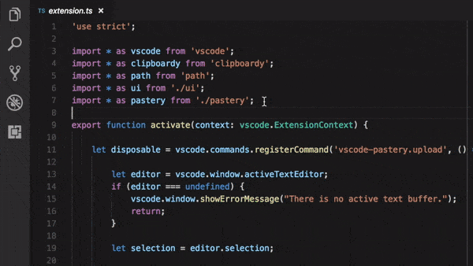

# Pastery for VSCode 🍰

Upload to [pastery.net](https://www.pastery.net/) directly from VSCode.

## Usage
* Open a file.
* Make a selection (optional).
* Press `ctrl+alt+P` or run `Upload to Pastery` from the Command Palette.

## Features

* Upload a file or a selection in a few seconds.
* Paste expiration delay can selected on paste creation.
* Paste name can be selected on paste creation (name of the file by default).
* Copies link to clipboard.

## Extension Settings

* `vscode-pastery.api-key`: your Pastery api key (can be found on your [account page](https://www.pastery.net/account/))

## Release Notes

See the changelog [here](CHANGELOG.md)
